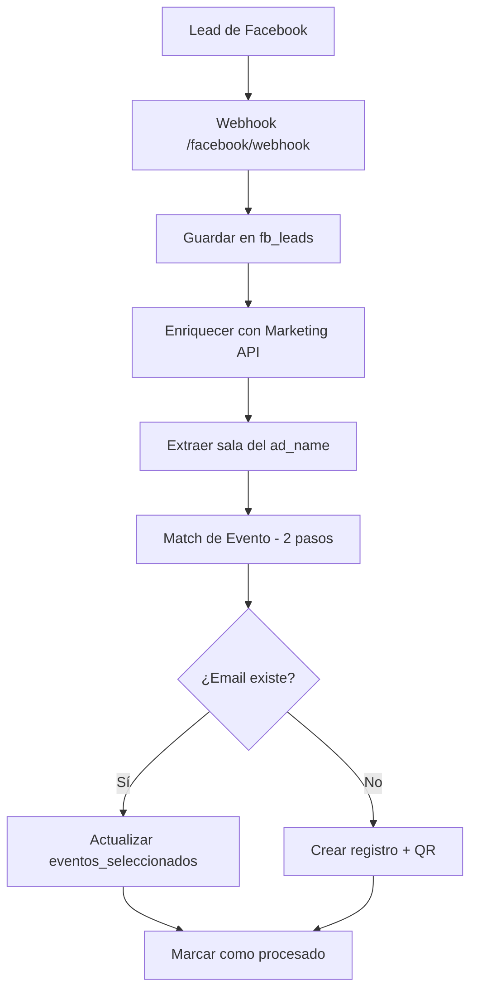

# Facebook Leads to MySQL con Consolidación Automática

Sistema automatizado para capturar leads de formularios de Facebook, almacenarlos en MySQL y consolidarlos automáticamente en la tabla de registros del evento Expokossodo.

## 🚀 Características

- ✅ **Webhook en tiempo real** para recibir leads de Facebook
- ✅ **Validación de seguridad** con firma X-Hub-Signature-256
- ✅ **Enriquecimiento automático** con Facebook Marketing API (nombres de campaña, adset, anuncio)
- ✅ **Matching inteligente de eventos** con algoritmo de dos pasos
- ✅ **Consolidación automática** a tabla `expokossodo_registros`
- ✅ **Generación de códigos QR** únicos por participante
- ✅ **Gestión de eventos múltiples** con JSON array
- ✅ **Prevención de duplicados** con marcado de procesados

## 📋 Requisitos

- Python 3.8+
- MySQL 5.7+
- Cuenta de Facebook Developer con App configurada
- Página de Facebook con formularios de leads activos
- Token de acceso a Facebook Marketing API

## 🛠️ Instalación

1. **Clonar el repositorio:**
```bash
git clone https://github.com/gfxjef/lead_facebook_to_mysql.git
cd lead_facebook_to_mysql
```

2. **Instalar dependencias:**
```bash
pip install -r requirements.txt
```

3. **Configurar variables de entorno:**
Crear archivo `.env` con:
```env
# Base de datos MySQL
DB_HOST=tu_servidor_mysql
DB_NAME=tu_base_datos
DB_USER=tu_usuario
DB_PASSWORD=tu_password
DB_PORT=3306

# Facebook API Principal
FB_APP_SECRET=tu_app_secret
FB_PAGE_ACCESS_TOKEN=tu_page_access_token
WEBHOOK_VERIFY_TOKEN=tu_token_verificacion

# Facebook Marketing API
MKT_TOKEN=tu_marketing_api_token
AD_ACCOUNT_ID=act_tu_account_id
PAGE_ID=tu_page_id
```

## 💻 Uso

### Desarrollo Local
```bash
# Iniciar el servidor
python app.py

# Para pruebas con túnel público
ngrok http 8000
```

### Producción (Render/Heroku)
```bash
# Se ejecuta automáticamente con gunicorn
gunicorn app:app --bind 0.0.0.0:8000
```

### Configuración del Webhook en Facebook

1. Ir a tu App en Facebook Developers
2. Configurar webhook:
   - **URL:** `https://tu-dominio.com/facebook/webhook`
   - **Token de verificación:** mismo valor que `WEBHOOK_VERIFY_TOKEN`
   - **Suscribir evento:** `leadgen`
3. Suscribir la página al webhook

## 🔄 Flujo de Procesamiento



## 📁 Estructura del Proyecto

```
lead_facebook_to_mysql/
├── app.py                      # Aplicación Flask principal
├── modules/                    # Módulos de lógica de negocio
│   ├── __init__.py            
│   ├── events_matcher.py       # Matching de eventos (2 pasos)
│   ├── lead_consolidator.py    # Consolidación a registros
│   └── qr_generator.py         # Generación de códigos QR
├── requirements.txt            # Dependencias Python
├── .env                        # Variables de entorno (no en git)
├── .gitignore                 
├── README.md                   # Este archivo
└── CLAUDE.md                   # Guía para Claude Code AI
```

## 🗄️ Base de Datos

### Tabla `fb_leads`
Almacena leads crudos de Facebook con enriquecimiento:

| Campo | Descripción |
|-------|-------------|
| `id` | ID único del lead (Facebook) |
| `form_id` | ID del formulario |
| `page_id` | ID de la página |
| `campaign_id/name` | Campaña publicitaria |
| `adset_id/name` | Conjunto de anuncios (Dia 1, Dia 2, etc) |
| `ad_id/name` | Anuncio específico |
| `sala` | Sala extraída (S1, S2, S3, S4) |
| `full_name` | Nombre completo |
| `email` | Correo electrónico |
| `phone` | Teléfono |
| `raw_json` | JSON completo con job_title y company_name |
| `procesado` | Flag de consolidación (0/1) |
| `created_time` | Fecha/hora de creación |
| `ingested_at` | Timestamp de inserción |

### Tabla `expokossodo_registros`
Tabla principal de registros consolidados:

| Campo | Descripción |
|-------|-------------|
| `id` | ID autoincremental |
| `nombres` | Nombre del participante |
| `correo` | Email (único por registro) |
| `empresa` | Empresa del participante |
| `cargo` | Cargo/puesto |
| `numero` | Teléfono/DNI |
| `eventos_seleccionados` | JSON array de IDs de eventos |
| `qr_code` | Código QR generado |
| `qr_generado_at` | Fecha de generación del QR |
| `confirmado` | Estado de confirmación |

## 🔐 Formato del Código QR

```
{3_LETRAS}|{DNI}|{CARGO}|{EMPRESA}|{TIMESTAMP}
```

Ejemplo: `JUA|12345678|Gerente|Tech Corp|1737548415`

## 🎯 Lógica de Matching de Eventos

El sistema usa un algoritmo de **dos pasos** para encontrar el evento correcto:

1. **Primer intento:** Normalización a 45 caracteres
2. **Segundo intento:** Comparación por texto antes de los dos puntos (:)

### Mapeo de Fechas
- `Dia 1` → 2 de Septiembre 2025
- `Dia 2` → 3 de Septiembre 2025  
- `Dia 3` → 4 de Septiembre 2025

### Mapeo de Salas
- `S1` → sala1
- `S2` → sala2
- `S3` → sala3
- `S4` → sala4

## 🔌 Endpoints API

| Método | Endpoint | Descripción |
|--------|----------|-------------|
| GET | `/` | Estado del servidor |
| GET | `/health` | Health check para monitoreo |
| GET | `/facebook/webhook` | Verificación del webhook |
| POST | `/facebook/webhook` | Recepción de leads |

## 🔒 Seguridad

- ✅ Validación HMAC-SHA256 de todas las peticiones
- ✅ Variables sensibles en `.env` (no en código)
- ✅ Inserción idempotente (evita duplicados)
- ✅ Procesamiento con transacciones MySQL
- ✅ Logs detallados para auditoría

## 📊 Monitoreo

Los logs muestran:
- `[INFO]` Leads recibidos y procesados
- `[MATCH]` Eventos encontrados y método usado
- `[INSERT]` Nuevos registros creados
- `[UPDATE]` Registros actualizados
- `[WARNING]` Eventos no encontrados
- `[ERROR]` Errores de procesamiento

## 🤝 Contribuir

1. Fork el proyecto
2. Crear una rama (`git checkout -b feature/AmazingFeature`)
3. Commit cambios (`git commit -m 'Add AmazingFeature'`)
4. Push a la rama (`git push origin feature/AmazingFeature`)
5. Abrir un Pull Request

## 📄 Licencia

MIT - Ver archivo LICENSE para más detalles

## 🆘 Soporte

Para problemas o preguntas, abrir un issue en GitHub o contactar al equipo de desarrollo.